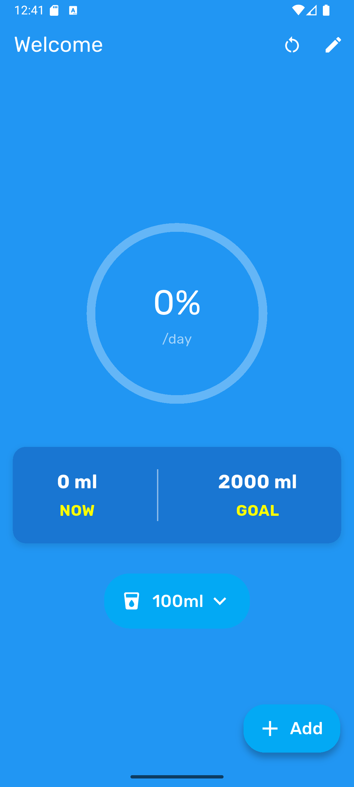
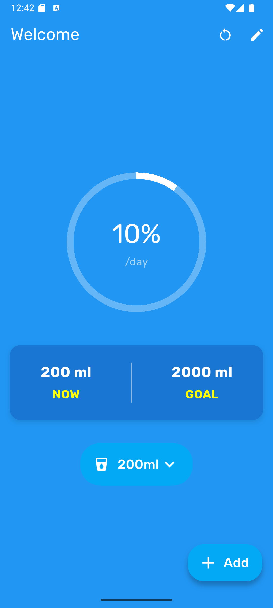
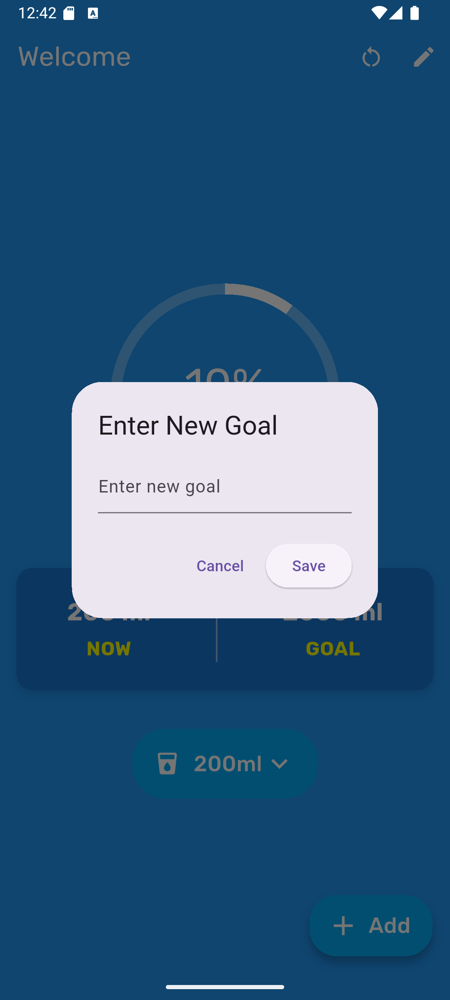

# 💧 Water Tracker App

A simple and intuitive **Water Tracker** app built with **Flutter**. The app helps users stay hydrated by tracking their daily water intake and setting hydration goals. 🚰

## 🚀 Features

* **Track Daily Water Intake:** Log and keep track of the amount of water you drink every day. 🥤
* **Set Custom Hydration Goals:** Easily set a daily water intake goal to ensure you stay hydrated. 🎯
* **Interactive Progress Tracker:** Visualize your progress with a circular progress indicator showing your daily water intake percentage. 📊
* **Easy Log Entry:** Add water intake in customizable increments (e.g., 100ml, 200ml). ➕
* **Clean UI:** A minimalist and user-friendly interface for a smooth experience. ✨

## 📸 Screenshots

### 🏠 Home Screen:
Track your water intake with a clean, intuitive layout.

<p float="left">
  
</p>

### 📈 Progress Tracker:
See your daily hydration progress with an interactive circular progress bar.

<p float="left">
  
</p>

### 🎯 Set New Goal:
Easily set your daily water intake goal with a simple dialog box.

<p float="left">
  
</p>

## 💡 How to Use

1. **Enter Water Intake Details:** Use the input fields to log the amount of water you've drunk. 📝
2. **Add Intake:** Tap the `+` button to add a predefined amount of water (e.g., 100ml, 200ml). ➕
3. **Set Your Goal:** Tap the goal button to set your daily hydration goal. 🎯
4. **Track Your Progress:** View your progress through the circular progress tracker, which updates as you log your water intake. 📊

## 🛠️ Getting Started with Development

To get a local copy up and running, follow these simple steps. 🔧

### 📥 Prerequisites

This project requires Flutter to be installed on your machine.

* Flutter SDK: https://flutter.dev/docs/get-started/install

### ⚙️ Installation

1. Clone the repo:

    ```bash
    git clone https://github.com/OnoPUNPUN/water_tracker.git
    ```

   (Replace `your-username` with your actual GitHub username and `water-tracker-app` with your repository name)

2. Navigate to the project directory:

    ```bash
    cd water-tracker-app
    ```

3. Get Flutter packages:

    ```bash
    flutter pub get
    ```

4. Run the app:

    ```bash
    flutter run
    ```

## 🤝 Contributing

Contributions are welcome! If you have suggestions to improve the app, please fork the repo and create a pull request. You can also open an issue with the tag "enhancement" for suggestions. 🙌

1. Fork the Project 🍴
2. Create your Feature Branch (`git checkout -b feature/AmazingFeature`) 🌱
3. Commit your Changes (`git commit -m 'Add some AmazingFeature'`) 📝
4. Push to the Branch (`git push origin feature/AmazingFeature`) 🚀
5. Open a Pull Request 🔄

## 📞 Contact

For any questions, suggestions, or feedback, feel free to reach out! 💬

- Email: tonmoywasimul04@gmail.com 📧
- Project Link: [Water Tracker App GitHub](https://github.com/OnoPUNPUN/water_tracker.git)
